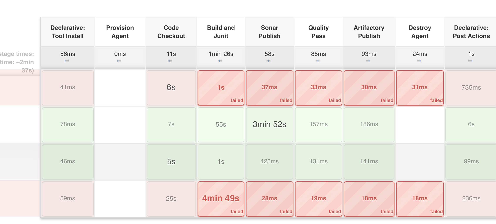

## Jenkins Shared Libraries

Repository contains pipeline shared libraries that can be hosted onto any Jenkins platform.

Objective is to ensure common CI-pipeline steps - Checkout, BuildnJunit, SonarChecks, Quality Gates, Artifactory Publish are applied to all the projects in general.


### Folder Structure 

#### vars/MavenBuild_CIpipeline

* Jenkins CI-Pipeline as service to be consumable by Java and Maven based projects written in groovy template.

* Used for Java projects that are based on maven builds.


### Versions supported and assumptions
Below are current supported maven and java versions and this support will be enhanced further.

* MAVEN_3_6 = maven3.6 builds
* JDK8 = Java 8 supported projects only.
* Sonar dashboard is hosted on URL: http://ec2-3-135-31-174.us-east-2.compute.amazonaws.com:9000

### Usage: MavenBuild_CIpipeline

The below 3 steps are common, for each and every Java application project's Jenkinsfile.

* Step1: Import shared libraries
```
@Library('jenkins-library@master') _
```

* Step2: Define Service inputs.

```
def inputConfig = [ 
    mavenEnv : "MAVEN_3_6", // mandatory: Available MAVEN_3_6, MAVEN_2_5
    microsoft_teams_webhook_name : "", // optional: name of the Team's webhook.
    microsoft_teams_webhook_url : "" , // optional: Notification URL of the teams, incase of build failed.
    branch : "master", // mandatory: project'sb ranch
    url : "git@github.com:nvkkgithub/spring-boot-demo-app.git", // git-url
    app_build_cmd : "mvn clean install -Dmaven.test.skip=false --settings settings.xml", // build command.
    app_sonar_publish_cmd : "mvn sonar:sonar -Dsonar.host.url=http://ec2-3-135-31-174.us-east-2.compute.amazonaws.com:9000"  // sonar publish command.
]
```

* Step3: Invoke Pipeline Service
```
MavenBuild_CIpipeline(inputConfig)
```

#### Final: Jenkinsfile

* Finally, Jenkinsfile should look like this. In Less than 20 lines (only configurations) - complete CI pipeline will be generated.

```
@Library('jenkins-library@master') _

def inputConfig = [ 
    mavenEnv : "MAVEN_3_6", // available MAVEN_3_6, MAVEN_2_5
    microsoft_teams_webhook_name : "",
    microsoft_teams_webhook_url : "" ,
    branch : "master",
    url : "git@github.com:nvkkgithub/spring-boot-demo-app.git",
    app_build_cmd : "mvn clean install -Dmaven.test.skip=false --settings settings.xml",
    app_sonar_publish_cmd : "mvn sonar:sonar -Dsonar.host.url=http://ec2-3-135-31-174.us-east-2.compute.amazonaws.com:9000",
    provisionDynamicAgent: true // true: provion dynamic slave, false: uses static slave
]
MavenBuild_CIpipeline(inputConfig)
```

#### Result of above
